#  Durian Disease Detection System

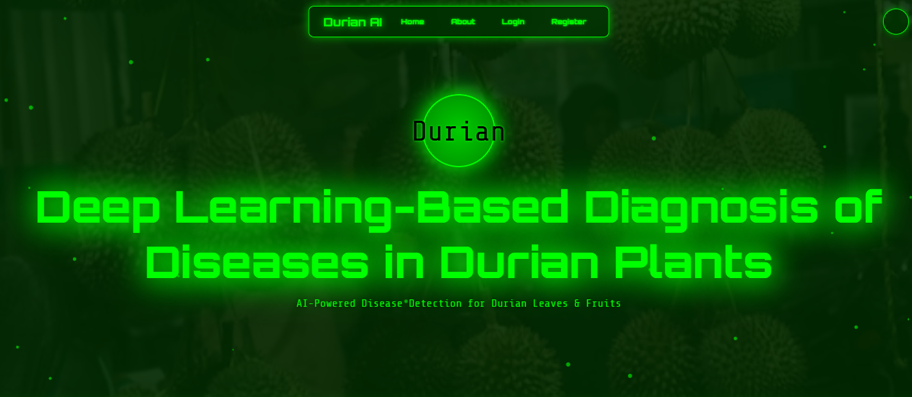

##  Overview
This project is a comprehensive **Deep Learning system** designed to automate the detection and classification of diseases in Durian plants. It addresses the challenge of manual inspection by providing a fast, accurate, and non-destructive method to identify diseases in both **leaves** and **fruits**.

The system features a user-friendly **Web Application** (Flask) where farmers or agricultural experts can upload images and receive real-time disease diagnosis, helping to minimize crop loss and improve yield.

##  Key Features
* **Hybrid Deep Learning Approach:**
    * **Leaf Disease Classification:** Uses **DenseNet-121** and **ResNet-101** to classify leaf conditions with ~94% accuracy.
    * **Fruit Defect Detection:** Uses **YOLOv11** and **YOLOv12** for real-time object detection of fruit defects.
* **Web Interface:** A responsive web app built with **Flask**, HTML, CSS, and JavaScript.
* **User Management:** Secure registration and login system with session management.
* **Performance Dashboard:** View model accuracy metrics (Confusion Matrices, F1-Scores) directly in the app.

## Tech Stack
* **Frontend:** HTML5, CSS3, JavaScript, Bootstrap
* **Backend:** Python, Flask
* **Deep Learning:** PyTorch, Ultralytics (YOLO), Torchvision
* **Data Processing:** Pandas, NumPy, OpenCV, Pillow
* **Database:** MySQL
* **Tools:** VS Code, Jupyter Notebook

---

## Disease Classes
The system is trained to identify the following specific conditions:

### Leaf Diseases (Classification)
1.  **Algal Leaf Spot**
2.  **Allocaridara Attack**
3.  **Leaf Blight**
4.  **Phomopsis Leaf Spot**
5.  **Healthy Leaf**

### Fruit Diseases (Object Detection)
1.  **Fungus**
2.  **Worm Infestation**
3.  **Damage**

---

## 📸 Screenshots

### System Architecture
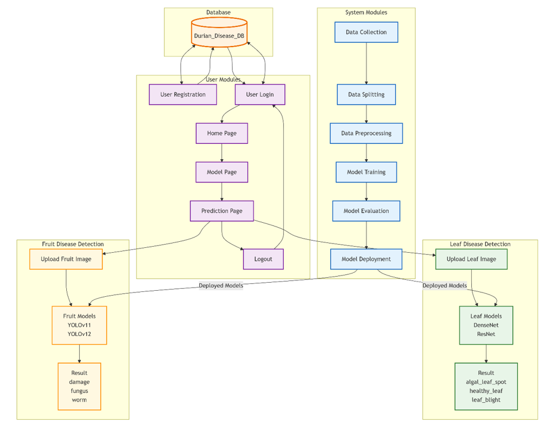
*The flow of data from user input to model prediction.*

### Leaf Disease Prediction
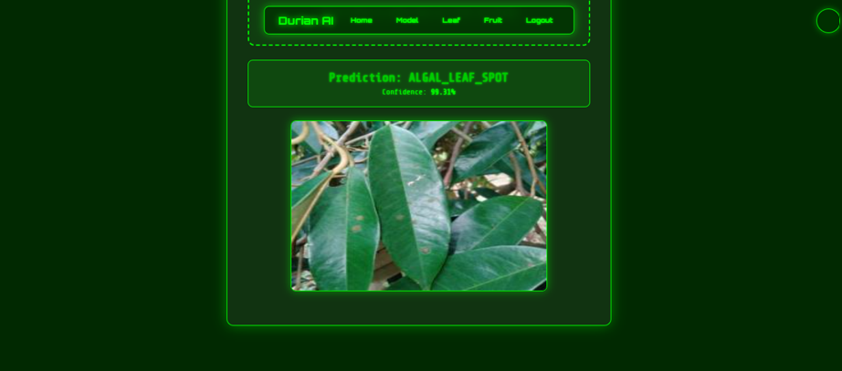
*Accurate classification of Algal Leaf Spot.*

### Fruit Defect Detection
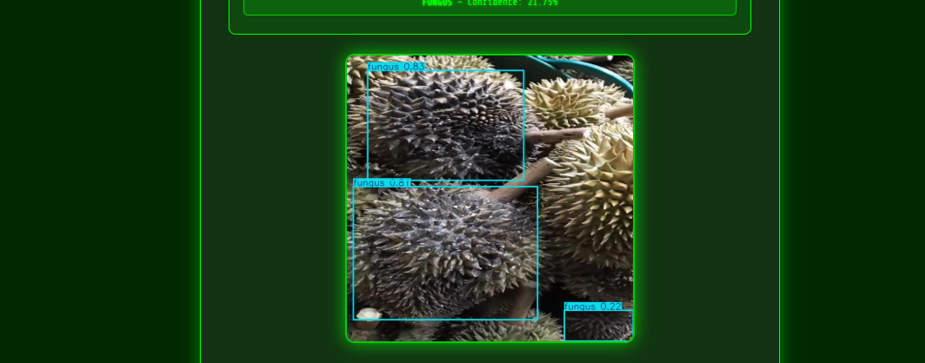
*Real-time bounding box detection of fungus on Durian fruit.*

### Model Performance
## Model Performance

### 1. ResNet
#### Classification Report
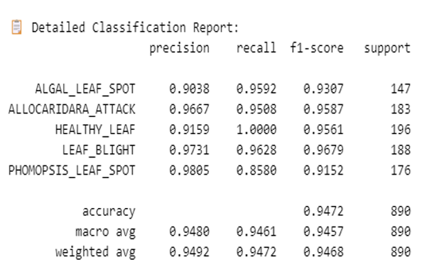

#### Confusion Matrix
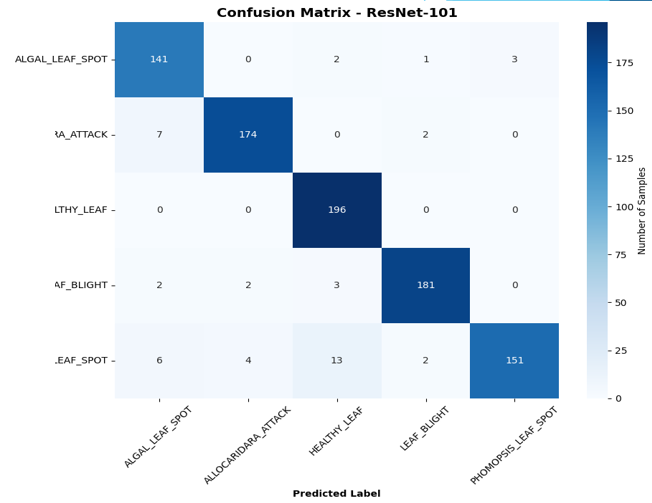

---

### 2. DenseNet
#### Classification Report
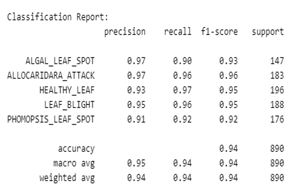

#### Confusion Matrix
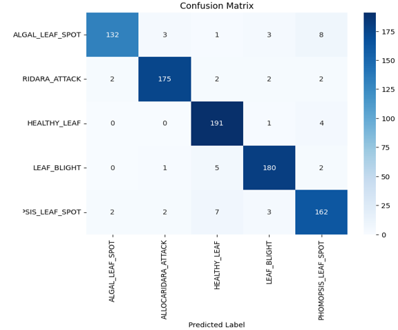

---

### 3. YOLOv11
#### Classification Report
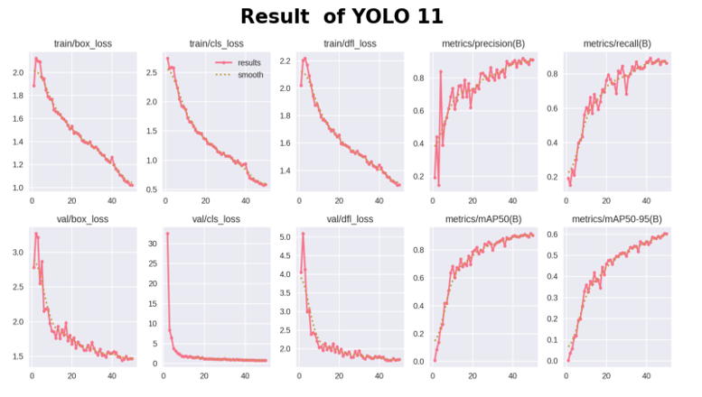

#### Confusion Matrix
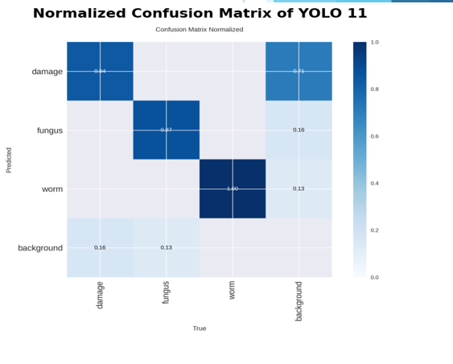

---

### 4. YOLOv12
#### Classification Report
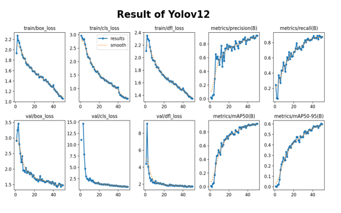

#### Confusion Matrix
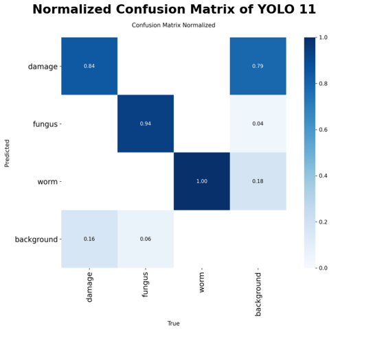
---

## Installation & Setup

1.  **Clone the Repository**
    ```bash
    git clone [https://github.com/Anikaith05/durian-disease-detection](https://github.com/Anikaith05/durian-disease-detection)
    cd durian-disease-detection
    ```

2.  **Install Dependencies**
    ```bash
    pip install -r requirements.txt
    ```

3.  **Install & Configure XAMPP**
    * Download and install [XAMPP](https://www.apachefriends.org/).
    * Open the **XAMPP Control Panel** and start the **MySQL** module.
    * Open your browser and go to `http://localhost/phpmyadmin`.
    * Create a new database (ensure the name matches your project configuration).
    * **Port Check:** Check the "Port" number listed next to MySQL in the XAMPP Control Panel (default is `3306`). Open `app.py` and ensure the database connection string uses this exact port number.

4.  **Set Up Database**
    * Import the `db.sql` file into your newly created MySQL database via phpMyAdmin.

5.  **Run the Application**
    ```bash
    python app.py
    ```
## Model Evaluation
* **DenseNet-121:** Achieved **~95% Accuracy** on leaf classification.
* **ResNet-101:** Achieved **~94% Accuracy** with high precision in identifying healthy leaves.
* **YOLOv11/v12:** Demonstrated high mAP scores, effectively detecting small defects like worm holes.

## Contribution
Contributions are welcome! Please fork the repository and create a pull request for any feature enhancements or bug fixes.

## License
This project is licensed under the MIT License.